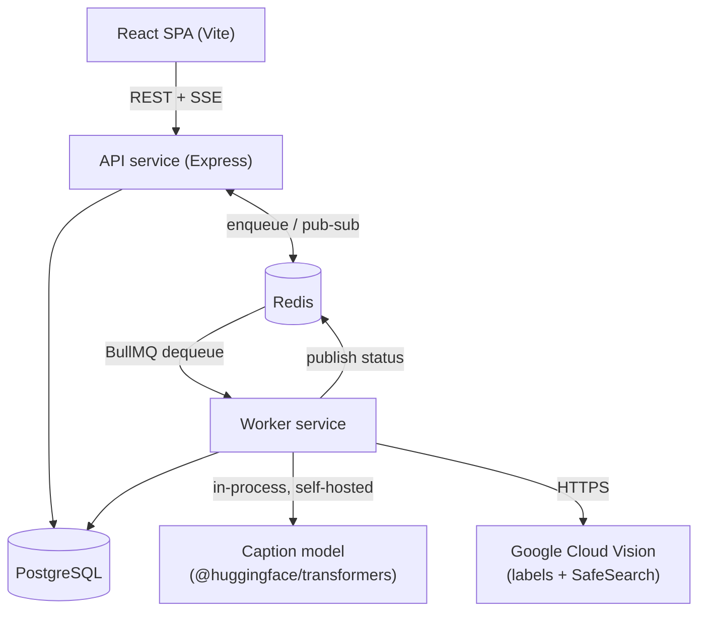

# Camarin AI — AI-Powered Media Processing Microservice

Users upload an image; the platform stores it, queues it, and asynchronously enriches it with AI-derived metadata (caption, labels, safety classification) without blocking the upload request.

PERN stack (PostgreSQL, Express, React, Node) with a BullMQ/Redis job queue, JWT auth, and live status updates over Server-Sent Events.

- **Backend details** (architecture decisions, API reference, env vars, testing): [`backend/README.md`](./backend/README.md)
- **Frontend details**: [`frontend/README.md`](./frontend/README.md)
- **API collection**: [`bruno/`](./bruno) (Bruno — export-compatible with Postman)
- **Deployed URL**: not yet deployed — currently verified via `docker-compose up` locally (see below)

## Architecture



Four independent services in `docker-compose.yml` (Postgres, Redis, API, Worker), plus a fifth for the frontend — matches what the spec asks a reviewer to actually see running, not just a diagram.

## Run locally

```bash
git clone <this-repo>
cd camarin-ai-assignment
cp backend/.env.example backend/.env    # fill in JWT secrets + AI API keys, see backend/README.md
cp frontend/.env.example frontend/.env
docker-compose up --build
```

Frontend: `http://localhost:5173` · API: `http://localhost:5002`

## Key decisions, at a glance

- **Auth**: JWT access (15min) + refresh (7d), both httpOnly cookies, bcrypt-hashed passwords.
- **Queue**: BullMQ + Redis, 3 attempts with exponential backoff (5s base).
- **Retry/state**: per-stage checkpointing in `job_results`' nullable columns — a retry (automatic or user-triggered) re-enters the same pipeline function and resumes from whichever stage isn't done yet, never re-running work that already succeeded.
- **Live updates**: SSE backed by Redis pub/sub (any API replica can serve any client's stream), 15s polling fallback if `EventSource` is unavailable.
- **Storage**: local bind mount for `docker-compose`, Cloudflare R2 for the deployed target, behind one adapter interface.
- **Captioning**: the assignment names `Salesforce/blip-image-captioning-base` via Hugging Face's API — that API no longer hosts any image-captioning model (verified directly, not assumed; see `backend/README.md`). Captioning is self-hosted in-process instead, via Hugging Face's own official JS runtime. Full reasoning and the exact substitute model are documented in `backend/README.md`.

## Known limitations

- Not yet deployed to a public URL.
- The self-hosted caption model doesn't fit a 512MB free-tier RAM budget even quantized — the deployment story for this specific piece is still an open decision (options documented in `backend/README.md`).
- Worker container has no HTTP health endpoint (`GET /ready` on the API does do a real Postgres/Redis check, just not the worker).
- No `/auth/me` endpoint yet — the frontend works around this client-side.

CI (`.github/workflows/ci.yml`, lint + test on every push/PR to `main`), structured per-request and per-job logging, and an OpenAPI 3.0 spec (`backend/openapi.yaml`) alongside the Bruno collection are all in place. Full list, with reasoning, in `backend/README.md` and `frontend/README.md`.
