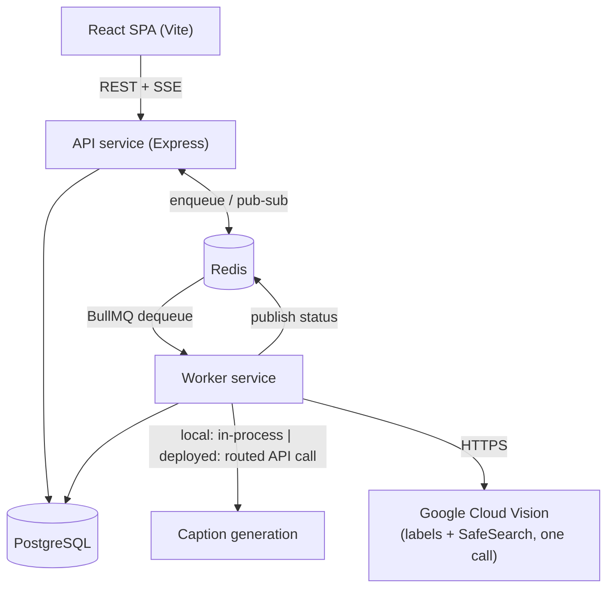

# Camarin AI — AI-Powered Media Processing Microservice

Users upload an image; the platform stores it, queues it, and asynchronously enriches it with AI-derived metadata — a caption, a set of labels, and a content-safety classification — without ever making the upload request wait on that processing.

**Live:**
- Frontend: [camarin-ai-assignment.vercel.app](https://camarin-ai-assignment.vercel.app) (Vercel)
- API: `https://camarin-ai-api.onrender.com` (Render — API + worker combined, see [Deployment](#deployment--the-real-story) below)
- Database: Neon (Postgres) · Queue/pub-sub: Upstash (Redis)

**Local:** `docker-compose up --build` — see [Run locally](#run-locally). This is the setup that shows the *real* architecture (API and worker as genuinely separate containers); the deployed instance runs them combined for a documented, free-tier reason.

**API collection:** [`bruno/`](./bruno) (open in the Bruno app, or import the Postman-compatible export at the repo root). OpenAPI spec: [`backend/openapi.yaml`](./backend/openapi.yaml).

This README is meant to be everything a reviewer needs — architecture, file layout, how the pipeline actually works, and the real deployment problems hit along the way — without having to go spelunking through `backend/` and `frontend/`. Those folders have their own READMEs with more implementation-level detail if you want to go deeper.

---

## 1. Architecture



**Four independent services** in `docker-compose.yml` — Postgres, Redis, API, Worker — plus a fifth for the frontend. This is deliberate: the assignment spec asks for a reviewer to run `docker-compose up` and see a *working system*, not just a diagram that claims separation while the code doesn't actually have it. Locally, if you kill the worker container, uploads still succeed and queue — they just stop processing until the worker comes back, which is the entire point of decoupling the two.

**Data flow, upload to completion:**

1. Client uploads an image with its JWT (httpOnly cookie) → API validates auth, then the file itself: declared MIME type checked against an allowlist, then the *actual bytes* re-checked via magic-byte sniffing (`file-type` package) since a client can trivially lie about `Content-Type` — and size, enforced by `multer`'s `limits` config server-side, not just a frontend check.
2. API writes the file to storage, creates a `job` row (`status: pending`), enqueues a BullMQ job carrying just the job ID, and returns `202 { job_id }` **immediately** — the request never waits on any AI call.
3. A worker (any replica — BullMQ needs no coordination between consumers on the same queue) dequeues the job, flips it to `processing`, and publishes that change over Redis pub/sub so any connected browser sees it live via SSE.
4. The worker runs two pipeline stages in order: caption generation, then Google Vision (labels + SafeSearch, one network call for both — see [Pipeline](#2-the-pipeline-in-detail)).
5. Each stage's result is written to the database **the moment that stage succeeds** — not batched at the end. This is the checkpoint mechanism that makes retries cheap; more on this below.
6. If SafeSearch returns `LIKELY`/`VERY_LIKELY` on any category, the job is flagged, a `job_flagged` notification is created, and it's surfaced distinctly in the job list — not just buried in a detail view.
7. Final status (`completed` or `failed`) is written and published over SSE.

---

## 2. The Pipeline, in Detail

This is the part most likely to come up in a follow-up conversation, so it's worth spelling out precisely rather than just pointing at a file.

### Checkpoint-per-stage, not full-pipeline restart

The spec calls the pipeline "three sequential AI tasks." We read "sequential" as *stage ordering*, not *no parallelism anywhere* — multiple jobs process concurrently across worker capacity, but for any one job, caption always resolves before labels/safety are attempted. (Google Vision actually returns label detection and SafeSearch from **one** `batchAnnotateImages` call when both features are requested, so what the spec frames as two separate steps is one HTTP round trip in practice — we still track them as two independently-checkpointed logical stages, because that's what actually matters for retry behavior, not the network call count.)

The `job_results` table stores `caption`, `labels`, and `safe_search` as **separate nullable columns**. `pipeline/runPipeline.js` is the single entry point for every pickup — a fresh job, an automatic BullMQ retry, or a user clicking Retry in the UI — and it always re-derives where to resume from whatever's already persisted:

```js
const needs_caption = !job_result || job_result.caption === null;
const needs_vision  = !job_result || job_result.labels === null;
```

There is no separate "first attempt" vs. "retry" code path. If caption succeeded and the Vision call then failed, a retry skips straight back to the Vision stage — it does not waste a second caption generation. A crash mid-write isn't a special case either: a Postgres column update is atomic, so a stage is either fully persisted or still `NULL` and correctly re-attempted. We also guard against redelivery of an *already-completed* job re-running for no reason (checked via `job.status` at the very top of the function) — cheap insurance against a duplicate notification if BullMQ ever redelivers a finished job after a Redis failover.

### Transient vs. permanent failures are distinguished at the source

Both pipeline stage modules tag thrown errors with `is_permanent`. A permanent error (a genuinely corrupt image, a 4xx from an AI provider that isn't a rate limit) sets `status: failed` immediately and does **not** get rethrown — there's no point burning a BullMQ retry attempt on something that will fail identically every time. A transient error (5xx, timeout, 429 rate limit) *does* rethrow, and BullMQ's own backoff config (3 attempts, exponential, 5s base delay) owns the retry from there — the next attempt re-enters `runPipeline` and resumes from whatever's checkpointed, per above.

One more layer: if BullMQ itself exhausts all 3 attempts on a transient error, `pipeline/handleJobFailure.js` (a `worker.js` event listener, pulled into its own module specifically so it's unit-testable without mocking BullMQ's `Worker` class) is what finally marks the job `failed` — otherwise a job that keeps hitting transient errors would stay stuck at `processing` forever once BullMQ gives up on it silently.

**A real bug we caught and fixed here:** the retry-from-UI endpoint originally called BullMQ's `job.retry()` without `{ resetAttemptsMade: true }`. Per BullMQ's own documented behavior, retrying a job that's already exhausted its attempts fails it again immediately without reprocessing — resetting our own Postgres `attempts` counter isn't enough, because BullMQ tracks its own separate `attemptsMade` internally. Confirmed against BullMQ's docs directly before shipping the fix, and covered by `tests/queue.service.test.js`.

### Captioning: a real deviation from the spec, and why

The spec names `Salesforce/blip-image-captioning-base` via Hugging Face's Inference API. We verified — not assumed — that this no longer works: `api-inference.huggingface.co` (the old free serverless endpoint) is fully decommissioned, and the named model has zero live inference providers mapped to it at all, free or paid.

**Locally / in `docker-compose`:** captioning runs self-hosted, in-process, via `@huggingface/transformers` (Hugging Face's own official JS runtime). The model actually used is `Xenova/vit-gpt2-image-captioning` — BLIP's own architecture turned out to be unsupported by this runtime's text-generation path (confirmed by direct test: it silently falls back to encoder-only mode), so this is the closest verified-working substitute, quantized (`q8`) to control memory. A real bug was found and fixed getting here: the runtime's alpha-channel image handling throws on any 4-channel PNG (i.e., most real screenshots), fixed by flattening every image to RGB with `sharp` before it reaches the model.

**Deployed:** the self-hosted model measures ~530MB at load and up to ~890MB during concurrent inference — over the RAM ceiling on Render's free tier (and its cheapest paid tier, which is still exactly 512MB; real headroom doesn't start until $25/mo). Rather than pay for that, the deployed instance switches to a routed API call instead, selected by one environment variable (`CAPTION_DRIVER=api` vs `local`), same `generateCaption()` interface either way — see [`backend/src/pipeline/caption.js`](./backend/src/pipeline/caption.js) for the driver-selector, same pattern already used for storage. Finding a model that's *actually* live on Hugging Face's Inference Providers marketplace took real verification, twice over — see [Deployment](#deployment--the-real-story) below, because it's a good story about not trusting the first "yes" you get from an API.

### Worker concurrency: measured, not guessed

`WORKER_CONCURRENCY` is `2`, and the number comes from an actual experiment, not a guess: Google Vision's quota (~1800 req/min) is nowhere near the binding constraint at any concurrency we'd realistically run. The self-hosted caption model was the real question — we ran 15 concurrent calls across 5 rounds against visually distinct images and confirmed zero cross-contamination against a sequential baseline (the model is safe to call concurrently), but elapsed time for 3 concurrent calls was roughly what 3 *sequential* calls take — the ONNX runtime doesn't meaningfully parallelize CPU inference within one process, so raising concurrency doesn't buy caption throughput. What it does buy is overlapping one job's I/O-bound Vision call with another job's CPU-bound captioning instead of the event loop sitting idle on a network round trip. Measured RSS at concurrency=3 was ~890MB vs. ~735MB at concurrency=1 — a real memory cost for a benefit that's about I/O overlap, not parallel speedup — so this stays at 2 rather than pushed to the verified-safe ceiling. Full reasoning is a comment directly above `WORKER_CONCURRENCY` in `backend/src/worker.js`.

---

## 3. Repository Layout

```
camarin-ai-assignment/
├── backend/                     — Express API + BullMQ worker, ONE codebase, two entrypoints
│   ├── src/
│   │   ├── index.js             — API entrypoint; also boots the worker in-process if COMBINED_MODE=true
│   │   ├── worker.js            — worker entrypoint (standalone, or required by index.js)
│   │   ├── app.js                — Express app: middleware, routers, error handling
│   │   ├── config/env.js        — all env vars read + validated here, fails fast on startup if anything required is missing
│   │   ├── routers/             — auth / job / notification route definitions
│   │   ├── controllers/         — thin — parse request, call a service, shape the response
│   │   ├── services/            — auth, job, notification business logic; queue.service.js (BullMQ producer); sse.service.js (Redis pub/sub ↔ SSE bridge); storage/ (local + R2 adapters behind one interface)
│   │   ├── pipeline/            — caption.pipeline.js (self-hosted), caption.api.pipeline.js (routed API), caption.js (driver selector), vision.pipeline.js, runPipeline.js (the checkpoint orchestrator), handleJobFailure.js
│   │   ├── middleware/          — auth (JWT cookie check), upload (multer + magic-byte check), validate (Joi), rateLimit (auth brute-force guard), errorHandler
│   │   ├── validations/         — Joi schemas
│   │   └── utils/                — prismaClient singleton, jwt sign/verify, pino logger, ApiError
│   ├── prisma/schema.prisma     — data model (Section 4 below)
│   ├── tests/                    — vitest: pipeline stage logic, checkpoint/resume behavior, the retry-bug fix
│   ├── Dockerfile, Dockerfile.worker — same codebase, different CMD
│   └── openapi.yaml
├── frontend/                     — React (Vite, plain JS/JSX, no TypeScript)
│   └── src/
│       ├── pages/                — Login, Signup, JobsList, JobDetail
│       ├── components/           — JobStatusBadge, SafetyBadge, FlaggedBanner, NotificationsBell, ProtectedRoute
│       ├── hooks/                — useJobStream (SSE), usePolling (fallback), useAuth
│       ├── context/               — AuthProvider (login/signup/logout state)
│       └── api/                   — axios client with a 401→refresh→retry interceptor, one file per resource
├── bruno/                         — API collection (Bruno-native; Postman-compatible export at the repo root)
├── docker-compose.yml             — Postgres, Redis, a one-shot migration step, API, worker, frontend — 5 real services
└── .github/workflows/ci.yml       — lint + test (backend, fully mocked, no live credentials needed) + lint + build (frontend)
```

**Why one backend codebase instead of two separate services/packages:** the API and worker share almost everything — Prisma client, job/notification services, the pipeline modules, `utils/`. Splitting them into separate npm packages (or a workspaces monorepo) would mean either duplicating that code or adding real cross-package dependency management for a 48-hour assignment. Two `Dockerfile`s pointing at different entrypoints (`src/index.js` vs `src/worker.js`) gets genuine container-level separation in `docker-compose.yml` without that overhead.

**Naming conventions** (`*.controller.js` / `*.service.js` / `*.router.js` / `*.validation.js`, snake_case Prisma models) match the author's existing production conventions from prior projects — deliberate, not accidental, and it means the generated Prisma client delegate mirrors the naming all the way down (`prisma.job_result.findMany()`, not `prisma.jobResult`).

---

## 4. Data Model

```
user(id, email unique, password_hash, created_at)

refresh_token(id, user_id fk, token_hash unique, expires_at, revoked_at nullable,
    user_agent, ip, created_at)
    — indexed on (user_id); hash of the issued refresh JWT, never the raw
      token, so a DB read alone can't reconstruct a usable session

job(id, user_id fk, filename, storage_key, mime_type, size_bytes,
    status enum[pending|processing|completed|failed], attempts, error,
    created_at, updated_at)
    — indexed on (user_id, status, created_at) for list-query performance

job_result(job_id pk/fk, caption, labels jsonb, safe_search jsonb,
    flagged, flagged_category, created_at)
    — caption/labels/safe_search being independently nullable IS the
      checkpoint mechanism described in Section 2; no separate stage-
      tracking table needed

notification(id, user_id fk, job_id fk, type, read, created_at)
    — indexed on (user_id, read)
```

---

## 5. Auth

JWT access token (15min) + refresh token (7d), both delivered as `httpOnly` cookies — never touched directly by frontend JS, which limits the XSS blast radius. `secure`/`sameSite` are set based on environment (`lax`+non-secure locally over HTTP, `none`+secure in production for the cross-origin Vercel↔Render setup). Passwords are bcrypt-hashed (cost factor 12). Every endpoint except `/auth/*` and the health checks requires a valid access token; `/auth/signup` and `/auth/login` are additionally rate-limited (10 requests / 15 min / IP) as a brute-force guard. The frontend's axios client transparently catches a `401`, calls `/auth/refresh` once (de-duplicated so concurrent failed requests don't trigger a refresh stampede), and retries the original request — a logged-in session survives past the 15-minute access token TTL without the user noticing.

Refresh tokens are session-backed, not purely stateless: a `refresh_tokens` table stores a SHA-256 hash of each issued token (never the raw token — same principle as `password_hash`) alongside `expires_at`, `revoked_at`, `user_agent`, and `ip`. `/auth/signup` and `/auth/login` both insert a row on success; on signup that insert shares a DB transaction with the `user` row itself, so a crash between the two can't leave a user with no session. `/auth/refresh` validates the presented token against that table — rejecting a missing or already-revoked row — then **rotates**: revokes the current row and issues a new access token *and* new refresh token in one transaction, so a captured-and-replayed old refresh token is rejected the moment the legitimate client rotates past it. `/auth/logout` revokes the row directly, so logout actually invalidates the session server-side instead of only clearing the browser's copy of the cookies.

**Current limitation:** no CSRF protection yet. httpOnly cookies stop XSS-based token theft, but don't stop CSRF — a malicious cross-origin page can still ride a logged-in user's browser session on a forged state-changing request, since cookies attach automatically. See [Known Limitations](#9-known-limitations).

---

## 6. Deployment — the Real Story

The spec's tech-stack table lists Cloud Platform, CI/CD, Auth, Queue, and File Storage as all open-ended, "document your choice." Here's what actually happened getting to a working deployed URL, including the parts that didn't work on the first try — because the decisions that survived contact with reality are more informative than the ones that just sounded reasonable on paper.

**Original plan:** Railway (API, worker, Postgres, Redis all as separate services). Dropped — Railway's free credits were already exhausted from prior personal-project usage, and adding a paid platform wasn't the right trade this late in a 48-hour clock.

**Checked the current (Jul 2026) free-tier landscape live, not from memory** — this space moves fast enough that stale assumptions would've cost real time:
- Fly.io no longer offers a free tier to new users at all (card required).
- Koyeb's free Starter tier was discontinued for new users after a provider acquisition earlier in the year.
- Render's free tier exists but **excludes Background Workers entirely** — a standalone worker service starts at $7/mo, and even that tier caps out at exactly 512MB RAM (no headroom over free).

**Landed on:** Render (one free Web Service running API + worker **in the same process**, since Render's free tier won't host a separate worker service) + Neon (free Postgres — doesn't expire, unlike Render's own free Postgres which does after 30 days) + Upstash (free Redis, TLS, works fine with BullMQ) + Vercel (frontend, unaffected by any of this). `COMBINED_MODE=true` on Render tells `src/index.js` to `require('./worker')` in-process after the HTTP server starts — same worker code, same pipeline, just invoked from a different entrypoint than the standalone `docker-compose` container. This is a **documented, free-tier-driven compromise for the hosted demo specifically** — `docker-compose.yml` still runs API and worker as genuinely separate containers, which is what actually demonstrates the architecture.

**Then the captioning model collided with the RAM ceiling** — covered in Section 2 above, but the deployment-specific part: finding a model that was *actually* live took two rounds of verification, not one. The first candidate, `Qwen2.5-VL-3B-Instruct` on the `featherless-ai` provider, showed as `"status": "live"` when queried directly against Hugging Face's own model-info API (`inferenceProviderMapping`). By the time the code was written against it, it had been delisted — that field doesn't get updated in real time. The fix was checking the router's own live catalog (`GET https://router.huggingface.co/v1/models`) instead of the model-info API's claim, which is what the router actually honors when a request comes in. That's the source of truth now, and it's what surfaced the model actually in production use: `Qwen/Qwen3-VL-30B-A3B-Instruct`. Two lessons that generalize past this one model: "the API says it's live" and "the API is actually live" are different claims worth checking separately when a deployment depends on it, and a marketplace-style API (multiple providers, hourly sync jobs) needs its *routing* layer checked, not just its *catalog* layer.

**One more wrinkle, worth naming because it's easy to get backwards:** the model responds via an OpenAI-compatible chat-completions shape (`task: "conversational"`), not a dedicated captioning endpoint — the request is a multimodal chat message (image + a tightly-worded prompt asking for a one-sentence caption), and the response is the model's free-form reply, not a clean single-field caption. `caption.api.pipeline.js` is built around that shape specifically; it isn't a drop-in swap with the local pipeline's request/response format, only its exported `generateCaption()` interface.

**CORS**, briefly: Vercel assigns a predictable project URL as soon as the project is named, so `CORS_ORIGIN` on Render was set correctly from the first deploy — no deploy-patch-redeploy round trip needed.

**Two more incidents, both from shipping session-backed refresh tokens after the initial deploy was already live** — worth including because they're a good illustration of what "it works locally" actually leaves out.

The first: after adding the `refresh_tokens` table and pushing, `/auth/signup` started returning a 500 in production — `"The table public.refresh_tokens does not exist in the current database"` — while working fine locally. Render's build command was `npm install && npx prisma generate`, which regenerates the Prisma *client* from the schema file but does not apply pending *migrations* to the live database; `docker-compose.yml` runs an explicit migration step that Render's build command had no equivalent of. Fixed by running `prisma migrate deploy` directly against the Neon connection string, and by changing Render's build command to `npm install && npx prisma migrate deploy && npx prisma generate` so a future schema change can't silently ship code that expects a table the database doesn't have yet.

The second surfaced right after: `/auth/refresh` started 500ing with `"Unique constraint failed on the fields: (token_hash)"`. Root cause was in `signRefreshToken` — the signed payload was just `{ user_id }`, and a JWT's `iat` claim only has second-level precision, so two refresh tokens issued for the same user within the same wall-clock second (a real path: login immediately followed by a request that 401s and triggers the axios interceptor's auto-refresh) come out byte-identical, hash identically, and collide on the table's unique `token_hash` constraint. Not a curl-testing artifact — a genuinely reachable production bug. Fixed by adding a `jti: crypto.randomUUID()` claim to the signed payload so no two issued tokens are ever identical regardless of timing. Both incidents were caught by live `curl` verification against the deployed URLs — signup, then refresh, then deliberately reusing an old token — rather than by the automated test suite, which doesn't yet cover `auth.service.js`; that gap is the most concrete, evidence-backed item in [Testing](#testing) below.

---

## 7. Scalability Under 10x Load

This changed from the original plan once captioning moved in-process, and it's worth being precise about *why* rather than reciting a generic answer.

**The bottleneck is no longer "external AI API rate limits" across the board — it's now split.** Google Vision's quota (~1800 req/min) is comfortably out of reach at any concurrency this service would realistically run — verified, not assumed (see Section 2's concurrency experiment). The real constraint at 10x load is the **self-hosted captioning model**: it's a single in-process singleton per worker, CPU-bound, and doesn't meaningfully parallelize within one process (measured, not guessed — 3 concurrent calls took about as long as 3 sequential ones). So throughput scales with *worker replica count × (1 / caption inference time)*, not with anything Google's quota would ever constrain first.

**What would actually help at 10x, concretely (not solving these, per the spec's own framing — articulating them):**
- **Horizontally scale worker replicas.** BullMQ needs zero coordination between consumers on the same queue, so this is a replica-count change, not a code change — the design already assumes this (see the checkpoint mechanism's redelivery-safety in Section 2). The cost: each replica loads its own ~530MB copy of the caption model, so this trades memory for throughput directly.
- **Or, extract captioning into its own always-warm service** that workers call over the network instead of loading the model in-process. Decouples "how many pipeline workers do I need" from "how many copies of a 530MB model am I running" — at the cost of a network hop per caption, and now a service to keep warm.
- **The deployed instance's `CAPTION_DRIVER=api` path sidesteps this entirely** by construction — a routed API call has no local memory cost regardless of concurrency, at the cost of depending on a third-party provider's own rate limits (which is where the *original* plan's bottleneck analysis still applies, for that specific path).
- **API layer** is already stateless — session state lives in Redis pub/sub, not in-process — so it scales horizontally the same way regardless of any of the above.
- **Postgres** would need connection pooling (PgBouncer) once worker replica count grows meaningfully, and `job` benefits from its existing `(user_id, status, created_at)` index continuing to cover list-query patterns at higher volume; very high volume would make time-based partitioning worth it.
- **Redis** is a single point of failure at real scale — mitigated by a managed/clustered provider, and made *safe* by the fact that job processing is already idempotent (the checkpoint mechanism), so a failover-triggered redelivery doesn't double-process anything.

---

## 8. Run Locally

```bash
git clone <this-repo>
cd camarin-ai-assignment
cp backend/.env.example backend/.env      # fill in JWT secrets + Google Vision API key; see backend/README.md for how to obtain each
cp frontend/.env.example frontend/.env
docker-compose up --build
```

Frontend: `http://localhost:5173` · API: `http://localhost:5002`. `CAPTION_DRIVER` defaults to `local` — no Hugging Face token needed to run the full pipeline locally; the self-hosted model downloads on first use into `.cache/models` (mounted as a named volume, so it survives container restarts).

Faster iteration loop without full rebuilds:
```bash
docker-compose up -d postgres redis
cd backend && npm install && npx prisma generate && npm run dev      # terminal 1
cd backend && npm run dev:worker                                      # terminal 2
cd frontend && npm install && npm run dev                             # terminal 3
```

## Testing

```bash
cd backend && npm test
```

Unit tests (`vitest`) cover the caption/vision pipeline stage functions (mocked AI clients), the full checkpoint/resume matrix across every combination of already-checkpointed stages, permanent-vs-transient error classification, the worker-level exhausted-retries safety net, the actual BullMQ backoff configuration values, and the retry-button `resetAttemptsMade` fix specifically. CI (`.github/workflows/ci.yml`) runs lint + test on every push with zero live credentials required — every external dependency (`prismaClient`, `storage`, the AI pipeline modules) is stubbed via `require.cache` substitution, confirmed by running the suite with `.env` removed entirely.

**Known gap:** `auth.service.js` (signup, login, refresh rotation, logout) has no automated test coverage yet — both incidents in Section 6's deployment story happened in this exact code path and were caught by manual `curl` verification against the live deployment, not by the suite. A rotation-flow test (sign up → refresh → assert the old token now rejects on reuse) is the single highest-value addition if this pipeline gets touched again; the pipeline stage tests above are the stronger suite precisely because that code has never shipped a bug the tests didn't already cover.

---

## 9. Known Limitations

- **No CSRF protection** (Section 5) — auth relies on httpOnly cookies alone; there's no double-submit CSRF token or equivalent, so a state-changing request forged from another origin would still carry valid auth cookies.
- The self-hosted caption model doesn't fit a 512MB free-tier RAM budget even quantized — worked around via `CAPTION_DRIVER=api` for the deployed instance (Section 2/6), not yet resolved for a fully-free self-hosted deployment.
- Worker has no HTTP health endpoint of its own (`GET /ready` on the API does check real Postgres/Redis connectivity, not the worker process specifically).
- No `/auth/me` endpoint — the frontend caches the sanitized user object client-side after login/signup as a workaround.
- `/uploads` (local storage driver only, not the deployed R2 path) is served unauthenticated via `express.static` — storage keys are unguessable UUIDs, which isn't the same as real access control.

## What We'd Do With More Time

- Add CSRF protection (Section 5) — a double-submit token (non-httpOnly cookie echoed back in a custom header, verified server-side on state-changing requests) now that session revocation is already in place to build on.
- A "log out all devices" / active-sessions UI — the `refresh_tokens` table already has everything needed (`user_id`, `user_agent`, `ip`, `revoked_at`) to list and bulk-revoke a user's other sessions; just no endpoint or UI for it yet.
- A dedicated always-warm captioning service (Section 7) to decouple memory cost from worker replica count.
- Kubernetes manifests with a Horizontal Pod Autoscaler on the worker deployment, scaled on BullMQ queue depth (`getJobCounts()`) rather than CPU — CPU is a poor signal here since workers spend most of their time waiting on I/O or running a fixed-cost inference call, not scaling with request complexity.
- End-to-end tests (Playwright) checked into CI, not just run manually during development.
- Per-provider circuit breakers around the Vision and captioning API calls, on top of the retry logic that already exists.
